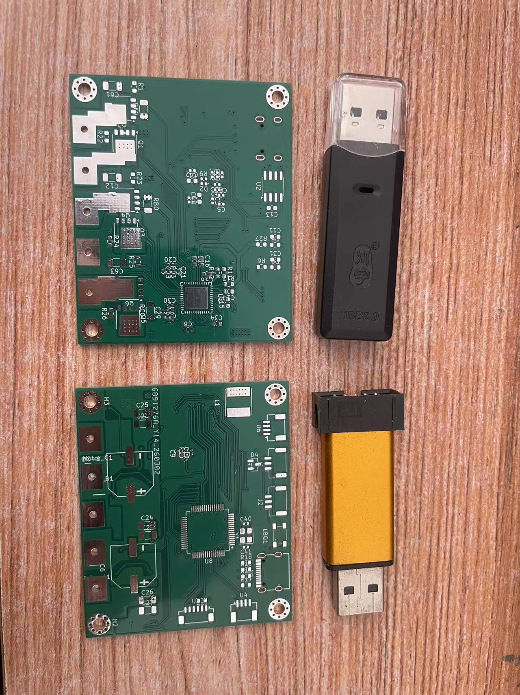
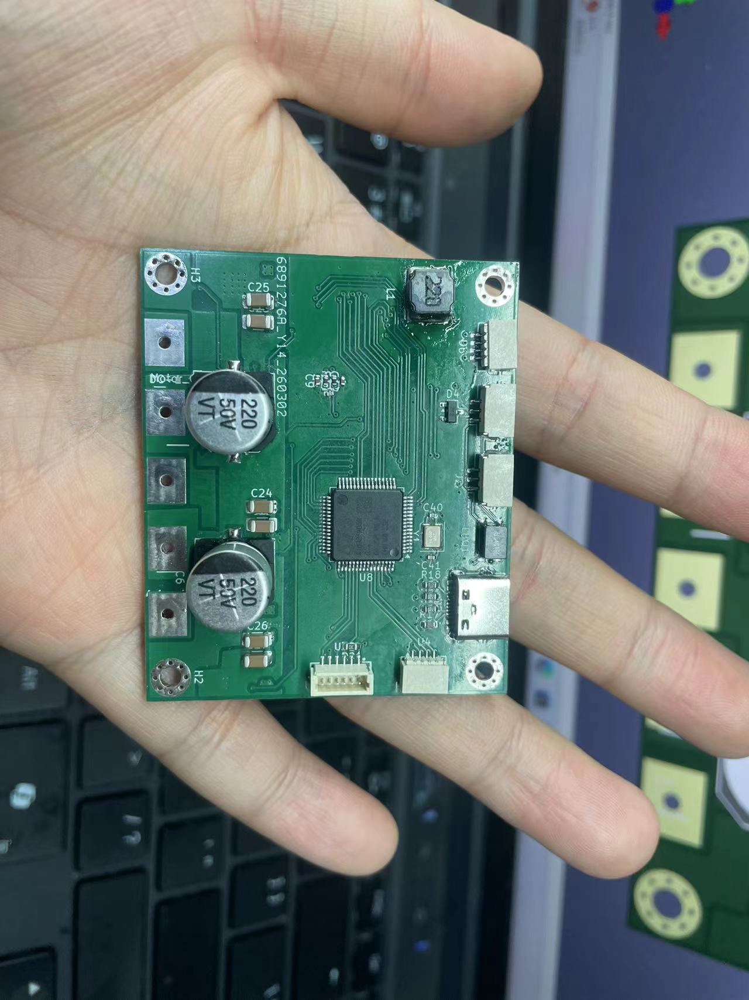

# ODrive-DRV8323-MT6701: 高性能自研 FOC 伺服驱动器

## 📌 项目简介
本工程将官方 ODrive v3.6 固件架构深度移植、重构并运行于**完全自研的 STM32F405RGT6 + DRV8323 功率板硬件平台**。通过重写底层外设驱动与传感器通讯时序，打通了高性能 Field Oriented Control (FOC) 电流、速度、位置三环全闭环控制，实现了针对无负载空载电机的丝滑、高动态伺服追踪。

---

## 📷 硬件实物与调试 (Hardware Gallery)

  
  

> **注**：V1.0 概念验证板由个人使用 EDA 独立布线，并采用加热台完成纯手工贴片焊接。为克服热焊盘未接地导致的地弹效应，底层驱动代码经过深度重构，确保在安全电流边界内稳定闭环。

---
## 🧰 硬件架构与自研设计 (Hardware Architecture & Design)

本驱动器硬件为从零独立设计的 V1.0 概念验证原型机（Proof of Concept），全流程涵盖原理图设计、4 层 PCB Layout（基于 KiCad），以及使用加热台的纯手工贴片焊接。

### 1. 设计规格与高功率密度目标
- **极小尺寸 (Form Factor)**：50mm x 60mm 超紧凑布局，专为微型轮足机器人关节或机械臂执行器设计。
- **目标性能 (Design Targets)**：24V 母线电压，目标持续相电流 20A，瞬态峰值电流 50A。

### 2. 核心关键选型
- **主控 MCU**：STM32F405RGT6 (168MHz Cortex-M4)，提供充沛的 FOC 矩阵运算算力与高级定时器资源。
- **智能门极驱动**：DRV8323（软硬结合），利用其内置的双向电流检测放大器（CSA）进行相电流采样。
- **位置观测器**：MT6701 磁编码器，使用高速抗干扰的 24-bit SPI/SSI 绝对值协议，摒弃了传统的 ABZ 增量脉冲。
- **功率采样**：低边侧 (Low-side) 选用 1.0mΩ 高精度合金采样电阻，最大化利用运放动态范围。

### 3. 硬件调试与 V1.0 勘误 (Hardware Errata & Workarounds)
作为初代原型板，在实测与大电流闭环推进过程中，排查出以下物理设计缺陷，并实施了系统级的规避策略：
- **防反接二极管极性修正**：在早期硬件 Debug 阶段，通过万用表排查并纠正了电源输入端肖特基二极管的丝印方向与实际贴片极性。
- **DRV8323 热焊盘（Thermal Pad）接地缺陷**：在 Layout 中遗漏了 DRV8323 背面热焊盘至系统功率地（Power GND）的覆铜连接。该焊盘不仅用于散热，更是驱动门极高频回流的关键路径。
- **系统级软件规避（Trade-off）**：为防止在高频 PWM 开关大电流时产生严重的**地弹效应（Ground Bounce）**导致芯片逻辑错乱，并在纯裸板无散热片的情况下控制热散耗，软件底层严格将运行相电流限制在 **3A** 的安全边界内。在此边界内，FOC 核心算法、ADC 采样时序与编码器通信已得到 100% 验证，实现了“软件验证优先于物理迭代”的敏捷开发闭环。
- ---

## 🛠️ 核心工作与软硬件底层攻坚

### 1. 硬件外设重映射与物理隔离 (BSP Hardware Remapping)
- **引脚复用冲突解决**：排查并解除了原版固件中 PA0 引脚被 `UART4_TX` 默认强拉高（2.9V）以及 Step/Dir 脉冲输入功能对物理引脚的强占，恢复其作为普通模拟/GPIO 的物理真实电平。
- **门极驱动使能修复**：解决了 TIM8 定时器初始化时错误复用控制 PB0 引脚，导致 DRV8323 的 `EN_GATE` 芯片使能脚被 24kHz PWM 信号高频误复位假死的致命 Bug，恢复硬件独立使能。
- **全局初始化拦截（隐身术）**：针对 ODrive 顶层管家婆机制（`gpios[]` 全局数组）在启动后期强行重置引脚为数字模式、断开芯片内部模拟开关的缺陷，在 `board.cpp` 中将复用引脚强行抹除（重设为 `nullptr`），彻底保住了 ADC 硬件引脚的模拟输入模式（`GPIO_MODE_ANALOG`）。

### 2. FOC 电流环打通与高精度 ADC 重构 (Current Loop & ADC Re-engineering)
- **寄存器级通道重映射**：摒弃了 HAL 库的间接层限制，通过在控制循环启动前直接修改 STM32 注入序列寄存器（`JSQR`），将 ADC2/ADC3 的采样视线从官方原版的 PC0/PC1 强行纠正对准自研板的 PA1/PA2 物理引脚。
- **偏置与幻觉电流消除**：将原版写死的 0.5mΩ 采样电阻参数修正为自研板焊接的 1.0mΩ 真实阻值（`SHUNT_RESISTANCE`）。彻底消除了 ADC 悬空电平带来的 20A 假电流报错，直面 1.43V（对应运放零偏电平）真实物理世界。
- **参数辨识对齐**：成功运行 `MOTOR_CALIBRATION`，精准测得电机相电阻 `0.1397 Ω`，相电感 `21.3 μH`，与电机官方物理说明书高度对齐，自动推导出电流环 D/Q 轴精准的 PI 增益。

### 3. MT6701 绝对值编码器 SPI 驱动手撕 (Custom 24-bit SPI/SSI Driver)
- **断开定时器依赖**：彻底摒弃增量式 ABZ 正交脉冲模式，切换为高精度 SPI 绝对值串行通讯。
- **24-bit 移位拼接解算**：在 `encoder.cpp` 中重写 `abs_spi_cb` 回调。配置 DMA 以 16-bit 格式连续读取两个 Word（共 32 位时钟），在内存中通过 `((uint32_t)word1 << 8) | (word2 >> 8)` 拼凑出 24 位原始数据流，并利用向右推 10 位（`>> 10 & 0x3FFF`）的过滤算法彻底剥离状态位，提取出纯净的 14 位绝对角度数据。
- **一次校准，开机直驱**：成功通过 `ENCODER_OFFSET_CALIBRATION` 辨识出转子磁场零位与编码器零位的物理偏置角（`phase_offset: 319`），断电保存至 Flash，实现了开机免旋转直接进入闭环的能力。

### 4. 动力学控制与死亡抖动调优 (Loop Tuning & Dynamics)
- **防反向电涌拉闸**：针对桌面可调电源无法吸收制动回馈能量的特性，合理放宽了系统过流/过压 Regen 安全保护网（`max_regen_current = 50.0`），允许母线大电容吸收瞬态冲击。
- **羽毛级 PID 参数驯服**：针对空载光杆电机在官方高增益下触发 1kHz 高频剧烈震荡从而倒灌过流死锁的现象，将参数降维调整至柔和的“羽毛级”参数（`vel_gain = 0.01`, `pos_gain = 1.0`），彻底抚平了空载震荡。
- **高阶轨迹规划**：启用了梯形轨迹规划模式（`INPUT_MODE_TRAP_TRAJ`），将加速、巡航速度、减速上限卡在 5.0 圈/秒。电机在接受位置阶跃指令时不再尝试“瞬间瞬移”，而是优雅、丝滑、精准地转动至目标圈数。

### 5. 无感控制算法攻坚：滑模观测器 (Sensorless FOC via SMO) - [WIP 进行中]
- **算法验证**：已完成滑模观测器 (Sliding Mode Observer) 的纯算法推导。构建了基于定子电流误差的滑模面，通过 Sign 函数提取扩展反电动势 (eBEMF)。
- **锁相环追踪**：设计了基于反电动势角度误差的 PLL (Phase-Locked Loop)，以提取连续、平滑的转子电角度与电角速度，替代传统的 Arctan 直接求角导致的噪声放大问题。
- **当前进度**：算法逻辑已验证，目前正在执行向 STM32 C++ 固件的底层移植与定点化/浮点性能调优。旨在实现“断开 MT6701 编码器后，电机依旧能平滑启动并中高速运行”的终极无感目标。
---

## 📊 调试现状 (Current Status)

- [x] **Hardware BSP Fixes** (引脚冲突、DRV8323 唤醒、模拟开关保卫战)
- [x] **Motor Calibration** (电阻、电感物理参数辨识 100% 对齐)
- [x] **Encoder SPI Communication** (14位绝对角度零超时、零丢步实时解算)
- [x] **Encoder Offset Calibration** (零位偏置永久刻录进 Flash)
- [x] **Closed Loop Position Control** (方波、阶跃、长距离正负多圈位置闭环极其精准)
- [ ] **Sensorless FOC (SMO)** (滑模观测器反电动势追踪部署与调试中)
